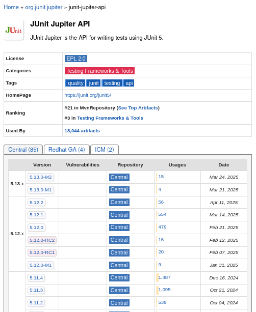
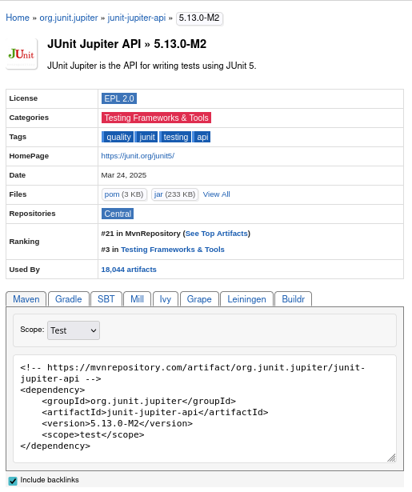
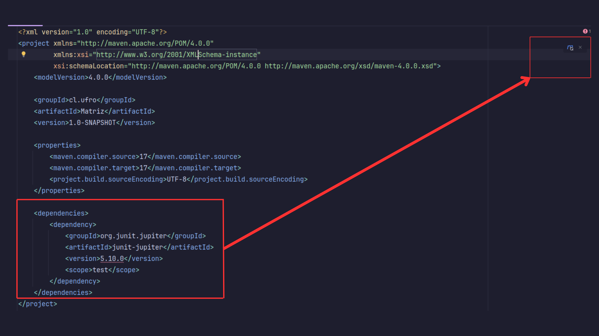
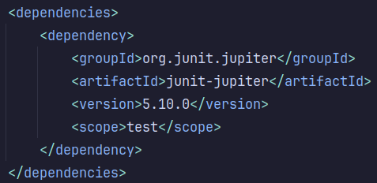
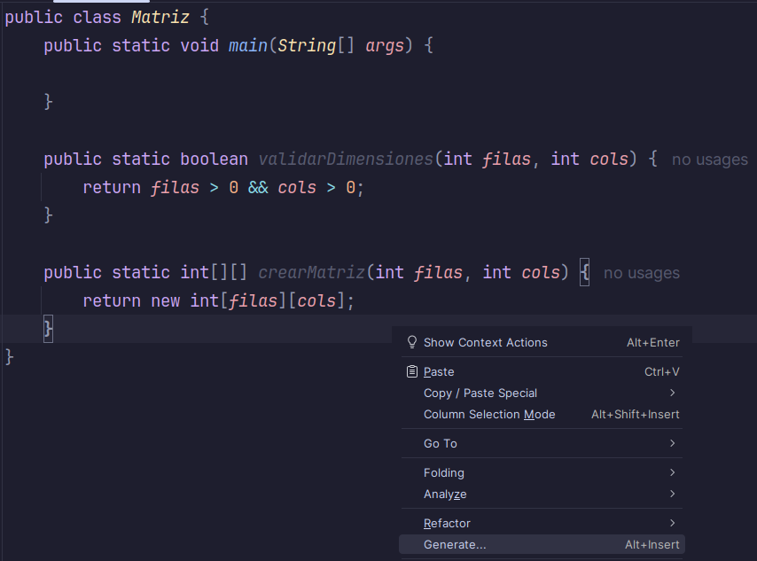
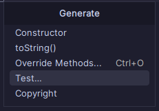
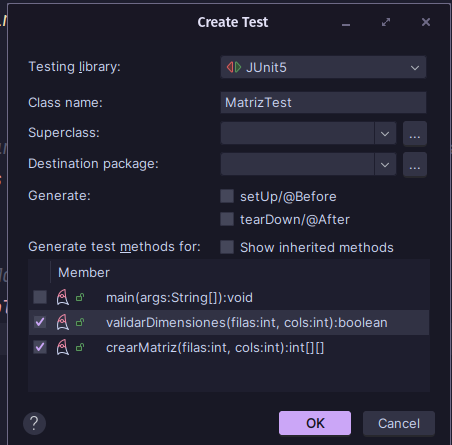
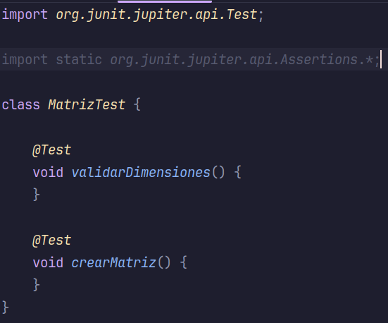

### Introducción a JUnit

**JUnit** es un framework para la **escritura y ejecución de pruebas unitarias**. Permite verificar que partes individuales del código (métodos o clases) funcionen correctamente de manera aislada, contribuyendo a la detección temprana de errores y al mantenimiento de un código confiable.

> Una *prueba unitaria* consiste en evaluar una unidad mínima de código para asegurarse de que su comportamiento es el esperado. Para que estas pruebas sean útiles, deben estar construidas sobre **casos de prueba bien definidos**, que evalúen el comportamiento esperado del sistema. Probar situaciones triviales o irrelevantes, como si una variable contenga un número específico sin relación con la lógica del sistema no aporta valor real.

---
### Arquitectura básica de JUnit

JUnit está compuesto por un conjunto modular de componentes, especialmente desde la versión 5, conocido como **JUnit Platform**. Esta versión se estructura en tres partes principales:

- **JUnit Platform**: Es la base de ejecución de pruebas y permite integrar otros frameworks.
- **JUnit Jupiter**: Contiene la API y las anotaciones modernas de JUnit 5.
- **JUnit Vintage**: Permite ejecutar pruebas escritas con versiones anteriores (JUnit 3 y 4).

Gracias a esta arquitectura modular, JUnit puede adaptarse a distintos estilos y necesidades de pruebas dentro de un mismo proyecto.

---
### Anotaciones esenciales en JUnit

JUnit proporciona diversas **anotaciones** que facilitan la escritura de pruebas organizadas y legibles:

- `@Test`: Marca un método como una prueba unitaria. JUnit lo detecta y lo ejecuta durante la fase de pruebas.
- `@BeforeEach`: Define un método que se ejecuta antes de cada prueba, ideal para preparar datos o instancias que se reutilizan.
- `@AfterEach`: Se ejecuta después de cada prueba, útil para liberar recursos si es necesario.
- `@BeforeAll` / `@AfterAll`: Ejecutan métodos antes o después de todas las pruebas, respectivamente.
- `@DisplayName`: Permite asignar un nombre legible o descriptivo a una prueba.

Además, se pueden utilizar métodos de **aserción**, como `assertEquals`, `assertTrue` o `assertThrows`, para verificar que los resultados obtenidos coincidan con los esperados.

---
### Integración de JUnit en un proyecto con Maven

Para utilizar JUnit en un proyecto Jav con Maven se debe agregar su dependencia en el archivo `pom.xml`. Maven se encargará automáticamente de descargar e integrar la biblioteca.

#### Paso 1: Buscar la dependencia

La forma correcta de obtener la dependencia es ir al sitio oficial de Maven Central y buscar **JUnit Jupiter API**:  
[https://mvnrepository.com/artifact/org.junit.jupiter/junit-jupiter-api](https://mvnrepository.com/artifact/org.junit.jupiter/junit-jupiter-api)




En la página, se selecciona la versión deseada y se copia el bloque XML correspondiente a la dependencia.

#### Paso 2: Agregar la dependencia al archivo `pom.xml`

Una vez creado el proyecto Maven, para utilizar JUnit como framework de pruebas es necesario agregar su dependencia correspondiente en el archivo `pom.xml`. Esta dependencia permite que Maven descargue automáticamente las bibliotecas necesarias para ejecutar pruebas unitarias con JUnit 5.

Dentro de la sección `<dependencies>`, se debe incluir el siguiente bloque:

```xml
<dependencies>
    <dependency>
        <groupId>org.junit.jupiter</groupId>
        <artifactId>junit-jupiter</artifactId>
        <version>5.10.0</version>
        <scope>test</scope>
    </dependency>
</dependencies>
```

Una vez agregada la dependencia, **IntelliJ IDEA puede mostrar un error** indicando que aún no reconoce la nueva configuración del proyecto. Esto ocurre porque el archivo `pom.xml` todavía no ha sido sincronizado.

Para resolver este problema, se debe hacer clic en el botón **Load Maven Changes**, ubicado en la esquina superior derecha del editor.




#### Paso 3: Generar archivo de pruebas

Dentro del código fuente de la clase que se desea probar se puede generar automáticamente una clase de prueba utilizando las herramientas del IDE. Para esto se debe:

1. **Hacer clic derecho** sobre el nombre de la clase o en cualquier parte del editor de código.

2. Seleccionar la opción:
> **Generate → Test**




Al hacer esto se abrirá una ventana que permite:

- Seleccionar el **nombre de la clase de prueba** (por defecto será `NombreClaseTest`).

- Indicar los **métodos que se desean incluir como base** en el archivo de pruebas.

- Configurar opciones adicionales como el uso de `@BeforeEach`, `@AfterEach` o la creación automática de métodos de prueba.



Finalmente, al presionar **OK** IntelliJ generará automáticamente la clase de prueba en el directorio correspondiente (`src/test/java/`) junto con la estructura base necesaria para comenzar a escribir las pruebas unitarias.


