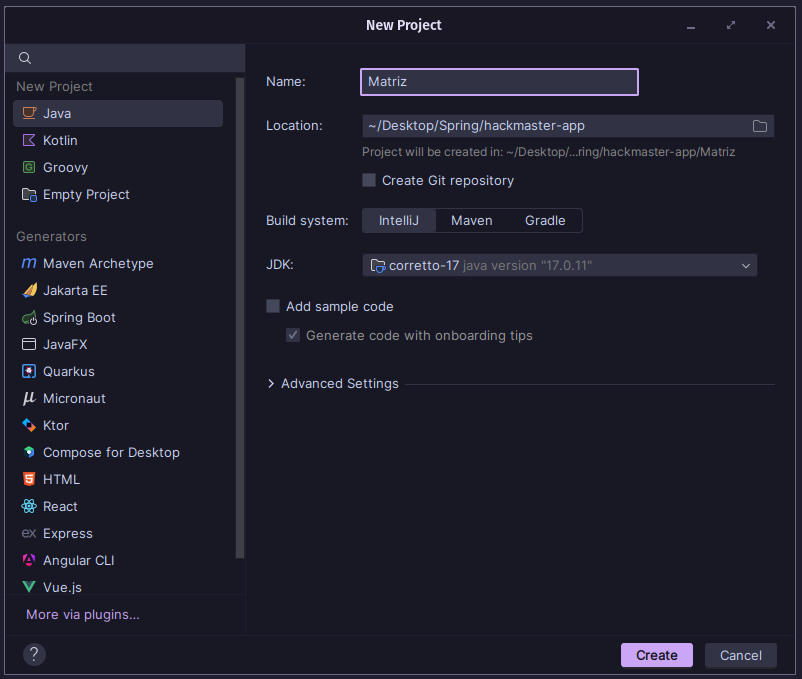

### Problemática al utilizar únicamente el sistema integrado de IntelliJ IDEA en proyectos Java

Actualmente nos encontramos trabajando con el sistema integrado por IntelliJ IDEA de manera predeterminada. Esto es algo que puede haber pasado desapercibido debido a la sencillez inicial que ofrece esta herramienta, especialmente cuando se trata de proyectos pequeños o experimentales.

> **Sistema integrado de IntelliJ IDEA:**  
> Es el mecanismo básico incluido en IntelliJ IDEA que permite crear, configurar y ejecutar proyectos Java sin necesidad de utilizar herramientas externas especializadas.

Sin embargo, este enfoque presenta ciertas limitaciones importantes a medida que los proyectos crecen o se requiere trabajar en equipo de manera eficiente.

---
### Limitaciones del sistema integrado de IntelliJ IDEA

#### Gestión limitada de dependencias externas

> **Dependencias:** Son bibliotecas o paquetes externos que un proyecto requiere para funcionar correctamente. Por ejemplo, al realizar pruebas unitarias con JUnit, este último es una dependencia externa que el proyecto debe incluir.

El sistema integrado de IntelliJ IDEA se limita a gestionar las dependencias de manera manual, lo que significa que el desarrollador debe:

  - Buscar manualmente cada biblioteca externa que necesita el proyecto.
  - Descargar manualmente los archivos (`.jar`) de dichas bibliotecas desde sus páginas oficiales.
  - Añadir cada uno de estos archivos de forma individual en la estructura del proyecto.

Esta gestión manual provoca rápidamente una problemática, ya que si se deben deben incluir varias bibliotecas, existiendo algunas con múltiples dependencias internas adicionales, se invíable en el tiempo mantener un control claro, generando errores difíciles de identificar y solucionar como versiones incompatibles entre bibliotecas.

---
#### Automatización insuficiente

La automatización es la herramienta que permite que procesos repetitivos se ejecuten de manera uniforme y libre de errores humanos si se hiciesen manualmente. Sin embargo, el sistema integrado en IntelliJ IDEA carece de estas capacidades avanzadas de automatizar el ciclo completo de desarrollo. Por ejemplo, 
  
  * Actividades como compilar automáticamente después de cada cambio. 
  * Ejecutar pruebas unitarias regularmente o generar paquetes listos para desplegar requieren ser configuradas y ejecutadas manualmente por el desarrollador. 

Esto solo aumentar considerablemente la carga de trabajo rutinario para el desarrollodr, incrementando también la probabilidad de olvidos o errores durante el proceso.

---
#### Problemas de escalabilidad y colaboración

Si bien el sistema integrado de IntelliJ IDEA funciona de forma eficiente para proyectos pequeños o individuales, presenta notorias limitaciones cuando se trabaja en un equipo de trabajo o el proyecto alcanza un tamaño considerable, ya que producto de la necesidad de realizar configuraciones manuales constantemente genera una estructura difícil mantener en el tiempo.

Esto ocurre porque:

  - Cada desarrollador configura manualmente su entorno de trabajo en IntelliJ IDEA, agregando bibliotecas y configuraciones según sea su criterio.
  - No existe un único archivo o estructura estándar común que determine qué dependencias se usan o cómo se estructura el proyecto, provocando que cada integrante tenga configuraciones potencialmente diferentes.

---
### Consecuencias en el flujo de trabajo

Aunque el sistema integrado de IntelliJ IDEA sea útil para ciertos tipos de proyectos, es notoria la carencia de la herramienta en situaciones donde una gestión eficiente de dependencias, una automatización robusta y un trabajo colaborativo bien estructurado sean parte principal de la solución . Esta problemática establece la necesidad de herramientas más especializadas que permitan superar estos desafíos en proyectos Java de mayor complejidad, como **Apache Maven**.
