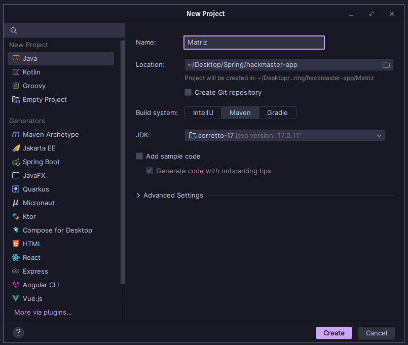
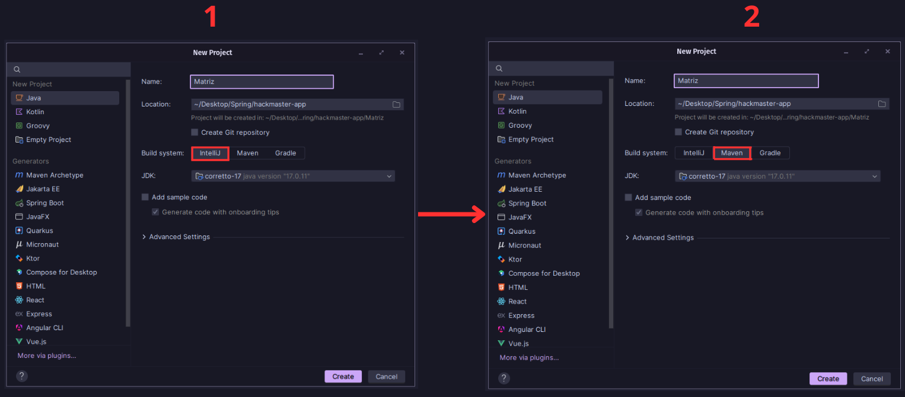
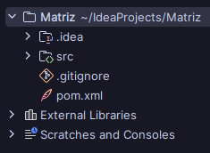

### Introducción a Apache Maven como solución a las limitaciones del sistema integrado de IntelliJ IDEA

Frente a las limitaciones del sistema integrado de IntelliJ IDEA (como la gestión manual de dependencias, falta de automatización avanzada y dificultades en la colaboración), aparece como solución **Maven**.

Maven permite realizar automáticamente tareas repetitivas que habitualmente consumen tiempo y son propensas a errores cuando se hacen manualmente, como gestionar dependencias externas, compilar código, ejecutar pruebas y generar paquetes finales listos para distribuir.

> Maven funciona de manera similar a un coordinador que gestiona automáticamente cada aspecto del proyecto, asegurando que las diferentes partes (código, pruebas y dependencias) trabajen sincronizadas, reduciendo al mínimo la intervención manual y los errores humanos.



---
### Cómo Maven resuelve las limitaciones identificadas

#### Gestión automática de dependencias externas

A diferencia del sistema integrado en IntelliJ IDEA, que requiere que las dependencias sean buscadas, descargadas y añadidas manualmente, Maven realiza todo este proceso automáticamente mediante un archivo de configuración denominado `pom.xml`.
 
> El archivo *POM* significa **Project Object Model** y presenta una extensión XML. la cual define la estructura del proyecto, sus dependencias, plugins, perfiles y otras configuraciones necesarias para construir y mantener el proyecto de forma automatizada.

Este archivo funciona como un listado detallado y claro donde se especifican las bibliotecas externas (dependencias) necesarias para el proyecto, fácilmente comprensible y compartible entre los integrantes de un equipo de trabajo, asegurando que todos trabajen con exactamente las mismas configuraciones.

**Ejemplo práctico:**  
Si un proyecto necesita utilizar la biblioteca JUnit para realizar pruebas unitarias, solo se debe incluir lo siguiente en el archivo `pom.xml`:

```xml
<dependency>
  <groupId>org.junit.jupiter</groupId>
  <artifactId>junit-jupiter</artifactId>
  <version>5.10.0</version>
  <scope>test</scope>
</dependency>
```

Maven automáticamente se encargará de descargar y organizar esta biblioteca junto con todas sus dependencias adicionales, evitando conflictos de versiones y errores derivados de la gestión manual.

---
#### Automatización avanzada del ciclo de vida

Maven provee una automatización completa del ciclo de vida del proyecto, realizando de manera automática tareas esenciales como:

  - Compilación automática del código fuente.
  - Ejecución automática de pruebas unitarias.
  - Empaquetado del proyecto para distribución.

Esto elimina la necesidad de ejecutar estas tareas manualmente, como ocurre con el sistema integrado de IntelliJ IDEA.

---
### Crear Proyecto

Para crear un proyecto Java en IntelliJ IDEA utilizando **Maven** como sistema de construcción, es necesario modificar la opción por defecto del entorno. En la sección **Build System** se debe seleccionar **Maven** en lugar de **IntelliJ**. Esto garantiza que el proyecto adopte la estructura y configuración estándar definida por Maven.



Una vez seleccionado Maven, IntelliJ habilitará opciones adicionales en la sección **Advanced Settings**, donde se deben definir los parámetros del proyecto:

- **GroupId**: Identificador del grupo o de la organización responsable del proyecto. Por ejemplo, `cl.ufro` para la Universidad de La Frontera.

- **ArtifactId**: Nombre del artefacto o proyecto. Este identificador será utilizado como nombre del módulo y en la generación del archivo `.jar`.

- **Version**: Versión del proyecto. Maven asigna por defecto `1.0-SNAPSHOT`, lo cual indica que el proyecto se encuentra en fase de desarrollo.

Estos valores se reflejarán automáticamente en el archivo `pom.xml`, que será generado por IntelliJ y funcionará como el descriptor principal del proyecto.

Finalmente, el proyecto generado quedará con la siguiente estructura:


